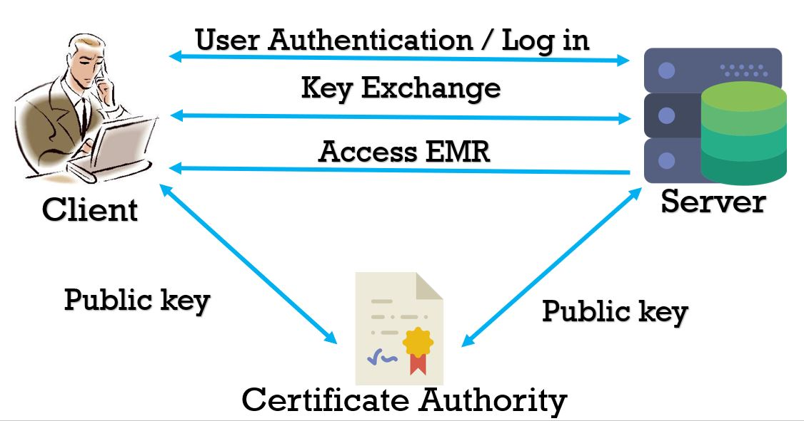
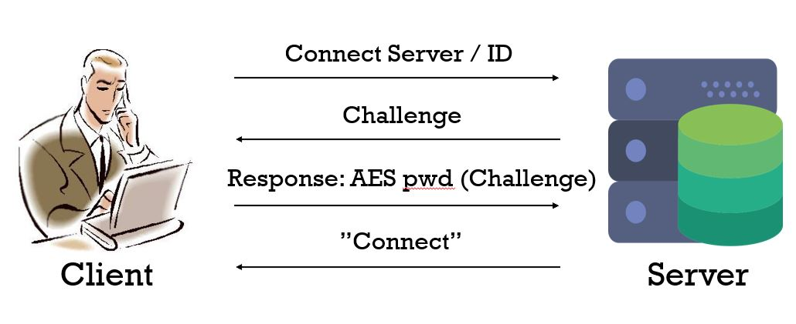
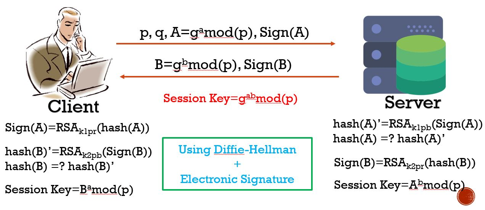
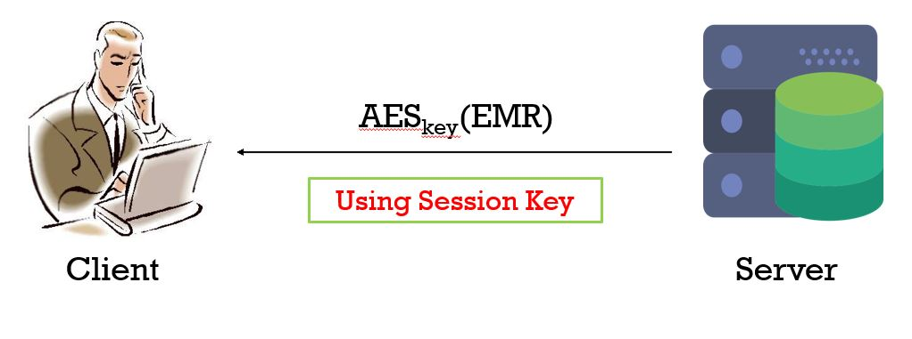

Main Concept
--------

Transferring Electronic Medical Records(EMR)using Diffie-Hellman Key Exchange & AES encryption

Concept Graph
--------

User Log in to Server
--------

Diffie-Hellman Key Exchange, Generate Session Key
--------

User Access EMR from Server
--------

Environment
--------

Python 2.7

Required Packages:
--------

-pycrypto

-hashlib

How to Run:
--------

1. run CA.py to generate AES key pair
2. run Server.py & Client.py